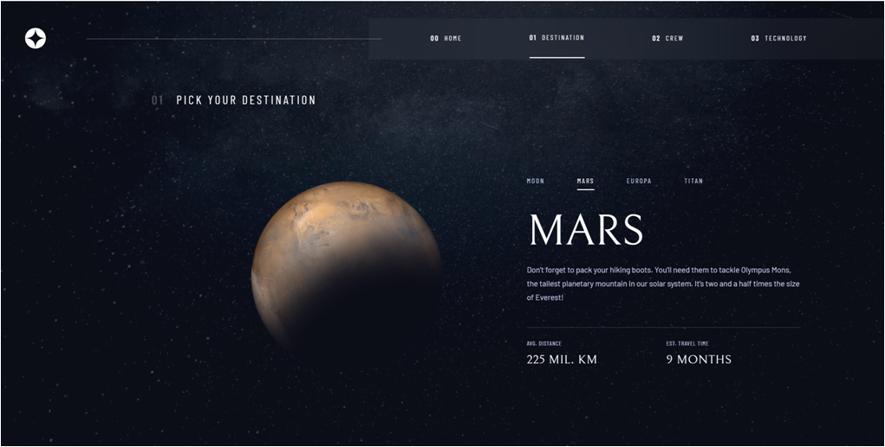
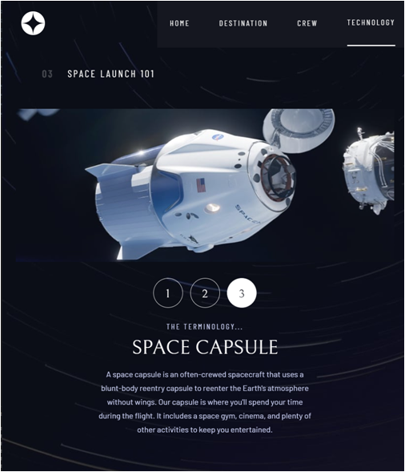
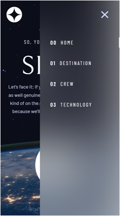

# Frontend Mentor - Space tourism website solution

This is a solution to the [Space tourism website challenge on Frontend Mentor](https://www.frontendmentor.io/challenges/space-tourism-multipage-website-gRWj1URZ3). Frontend Mentor challenges help you improve your coding skills by building realistic projects. 

## Table of contents

- [Overview](#overview)
  - [The challenge](#the-challenge)
  - [Screenshot](#screenshot)
  - [Links](#links)
- [My process](#my-process)
  - [Built with](#built-with)
  - [What I learned](#what-i-learned)
  - [Continued development](#continued-development)
  - [Useful resources](#useful-resources)
- [Author](#author)
- [Acknowledgments](#acknowledgments)

## Overview

### The challenge

Working from figma, I coded "from scratch" the space tourism website.
Users should be able to:

- View the optimal layout for each of the website's pages depending on their device's screen size
- See hover states for all interactive elements on the page
- View each page and be able to toggle between the tabs to see new information

### Screenshot

The site is currently optimised for 3 different screen sizes (mobile, tablet and desktop).

### Links

- Solution URL: [https://github.com/Stecathw/SpaceTourism/tree/main/spacetourism](https://github.com/Stecathw/SpaceTourism/tree/main/spacetourism)
- Live Site URL: [https://space-tourism-challenge.herokuapp.com/](https://space-tourism-challenge.herokuapp.com/)

## My process

Currently worked time on project : around 10 days. (part time)

1 - Initialized project with react and sass and a brand new fresh app ready to be coded. Also, installed react router dom. 
Deleted all useless things bring by create-react-app process.

2 - Created folder for pages Home/Destination/Crew/Technology and implemented four navigations routes.
Created folder for components and created main Nav component.
Created main folder for Sass styling.

3 - Written html home page before applying first stylesheets with saas later and have some direct viewable feedback.

4 - Started sass setting up. Created a _globa-settings and _background-settings for convenience and ease of setting up general styles. 

5 - Written Nav component. 

6 - Making styles of Nav component.

7 - Written home page with styles

8 - Written destinations page with styles

9 - Written crew page with styles

10 - Written Technology page with styles

11 - Refactored Home page with useContext hook to manage state between tabs and page description/image. Helps to make break page into more components.
So now for each pages there will be anoter util folder with a Context.js and GetData?js file.

12 - While breaking apparts into more components, I've restyled components. Breaking apparts components + styles makes things easier to work on (litle by little, one by one) and I hope it will keep things more organised with a better architecture and moreover makes life easier while working with responsiveness later on my process. (even if I've already written some media queries, it's now more about rewritting things) => Its now possible to focus only on one components and its behavior.

13 - Came back on home page and worked mobile menu. I've installed styled-components, https://styled-components.com/docs/basics and implemented my mobile menu using https://css-tricks.com/hamburger-menu-with-a-side-of-react-hooks-and-styled-components/. By the way one of my favourite ressources when building frontend things.
Used this tutorial to make things faster and easier. I want to focus more on responsive stuff.

14 - Focused on scss design

15 - React pages all written.

16 - First deployment and tests.

17 - Fixes and refactoring parts of code.

18 - New deployment

19 - Made some fixes and implemented the swipe possibility with react-swipeable lib. Only destinations page got that feature at this point. I'm asking myself about performance and efficiency of code here see notes in [Continued development](#continued-development)

20 - Added swipe feature to crew page. NB as a choice and not to rewright everything, only swiping on menu and text is possible (a box with both content). Images aren't listening to window events.

### Built with

- Sass
- Flexbox
- CSS Grid
- [React](https://reactjs.org/) - JS library
- [React-swipeable](https://www.npmjs.com/package/react-swipeable) - For swipe and touch events.
- [React-router-Dom] (https://reactrouter.com/) - For navigation
- [Styled Components](https://styled-components.com/) - For some styles

### What I learned

I've learned that it is not as easy to make things look like the figma design. I had to think about architecture and design patterns to break things into components and keep the whole project as simple as I can and not that messy. Many design choices are then bring to interpretations Sometimes I had to came back on my initial approach to achieve what I intented to do. I made a lot of back and forth between figma and website under developments and still they are lot of interpretation a single figma graphism can't solve alone. (missing communication with a team ? between UI/UX and dev ?!) For instance how should behave components with responsiveness ?

I've learned useContext along with CreateContext and Provider Context. (Redux was a bit too much for this app)
As I've many times faced trouble when managing states while breaking aparts a page into components I need useContext to makes things easier but not to complex. 
So every pages were firstly written whithout useContext hook. It was a simple and efficient way to code each pages but not that scalable.
And then I decided I want to break app into more components to better organise both the app and my work. I've refactored all my pages into components using this hook.

I introduced myself to useRef (for mobile menu) and useReducer along with dispatch event. But here i want to go deeper and have work...

Even if I've used grid and flexbox in previous projects, I guess I gained deeper understanding about them but still a lot under the hood to understand. 

Styled-component lib is realy usefull to handle dynamic styles behavior along with states.

### Continued development

- Working on perfomance and loading data and image ? (Lazy loading perhaps ?)
  -> useReducer and dispacth for wipe events
  -> Find out if they are more rerenders in my components than necessary since I used use Context and value are often change (normally only when window event, just in case... and by curiousity)

- UX side : 
  General transitions and animations. (A lot can be done, creativity here...)
  Horizontal scrolling on tabs and submenu (as well as finger slide on mobile device) on all pages.

- Transitions between pages and 404 error page.

- Fixing vertical responsiveness and handling more screen sizes. (Really small width devices encounter a Y axis decentered .main div)

- Creating params and url routes for tabs and submenus (I've tried it with react router dom but was locked since I didn't find how to pass an optional argument into path)

### Useful resources

- [Styled components](https://styled-components.com/docs/basics) - This helped me to implement mobile menu.

- [CSS Tricks](https://css-tricks.com/snippets/css/complete-guide-grid/) - This is an amazing website to take reference from whether for CSS Grids and CSS flexbox layouts. And even more...

 - [Heroku subdirectory deployment](https://janessagarrow.com/blog/how-to-deploy-a-subdirectory-to-heroku/) - For deployment purposes from a subdir. Use : "git subtree push --prefix spacetourism heroku master"

 - [Heroku CLI](https://devcenter.heroku.com/articles/heroku-cli)

## Author

- Website - [William](https://mon-cv-en-ligne.herokuapp.com/)

## Acknowledgments

I've started coding this project from a blank react project, no templates were used. I kept myself away from looking to Scrimba solution or any other solutions that could be found online. 
Therefore this is truly my own solution and many things are discutable and prompt to errors as I consider myself as a beginner.
